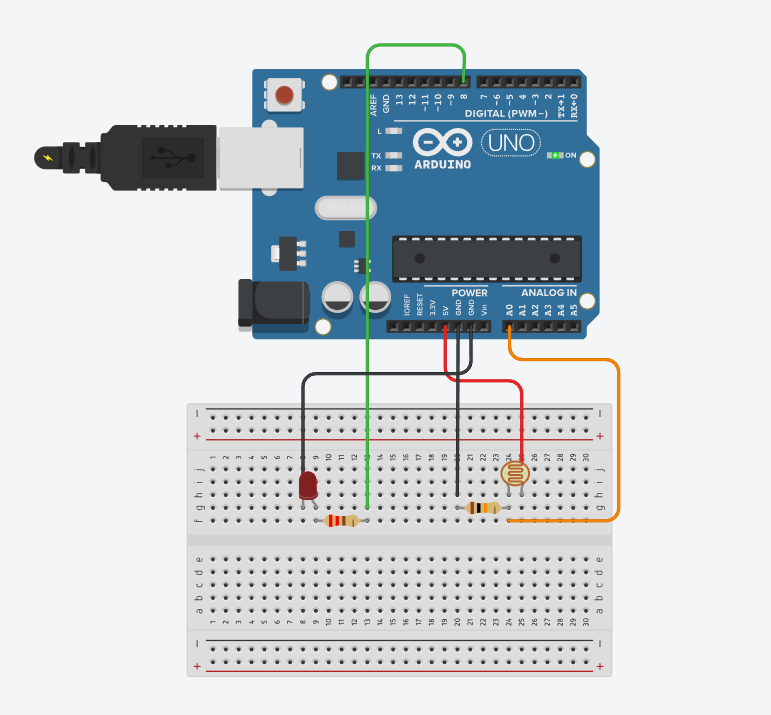

# Automatic LED Lighting Project with LDR
This project uses a Light-Dependent Resistor (LDR) sensor to detect ambient light levels and automatically turns an LED on or off based on that level. The project is implemented using serial communication between an Arduino and Python.
## Project Description
The main goal of the application is to turn on the LED when it gets dark and turn it off when the environment brightens. This automation is achieved with a Python program using the PySerial module and an Arduino board that reads the LDR sensor.
Arduino: Continuously sends the analog value read from the LDR to the serial port.
Python: Reads the values coming from the Arduino, decides whether the environment is dark or bright based on a predefined threshold, and sends commands ('1' or '0') to the Arduino to control the LED accordingly.
## Features
Automatic Control: Automatic LED control sensitive to ambient light via the LDR sensor.
Serial Communication: Reliable serial communication between Arduino and Python.
Flexible Threshold: The sensitivity can be easily adjusted using the LDR_esik_degeri variable in the Python code.
Energy Efficiency: The led_kontrol function prevents unnecessary command loops by changing the LED's state only when necessary.

## Technologies Used
Hardware: Arduino Uno, LDR (Light-Dependent Resistor), LED, 10k Ohm Resistor and 220 Ohm Resistor, and Jumper Wires.
Software: Arduino IDE, Python 3.x.
Python Libraries: pyserial, time.

# Setup and Usage
## Development Phase
Set Up the Circuit: Place the specified circuit components on the breadboard according to the schematic and make the connections.
Install Necessary Libraries: Install the pyserial library for Python via the terminal using the pip install pyserial command.
Prepare the Code: Write both the Arduino and Python code required for the project.

## Application Phase
Prepare the Hardware: After setting up the circuit, connect your Arduino board to your computer with a USB cable.
Upload the Arduino Code: Compile and upload the code to your board from the Arduino IDE. Close the Arduino IDE after the upload is complete.
Run the Python Code: After adjusting the COM port number to match your board, run the Python file.
# Circuit Diagram
The diagram below shows how to connect the LDR and LED to the Arduino.

